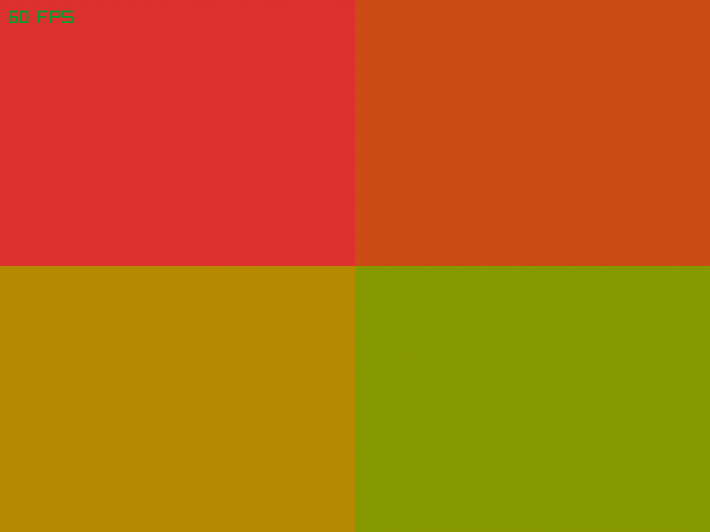
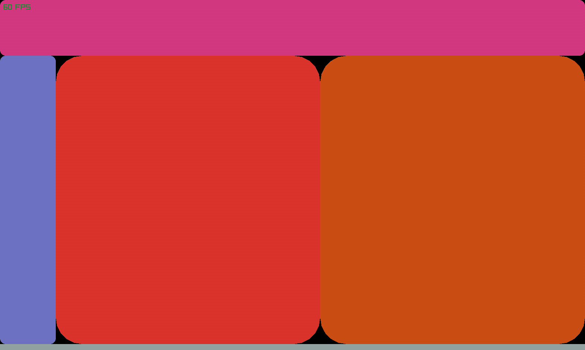

proof of concept layout dsl

### rant

the main impredence to reactive layouts is to subdevide rectangles. And like poeple probaly are using webshit like eltron to get css, not because css is good, but because its the main option

take aways:

1. "grids" are a good idea, first draw veritcal lines, then horzonal lines then you pick 4 lines to make a rectangle, paired with somesort of alias; space partition trees ARE INSANE, no human wants them acdemia.

2. calc while hard to google for, is comfy to work with http://www.isthe.com/chongo/tech/comp/calc/

3. its easy to mix up lines going up and down being important for the *X* of the rectangles, and lines left to right for Y

### plans

I *cant* focus on this right now, and I want something to magicly appear to intergreat with; please tell me someone will pick this up and make something clean and simple